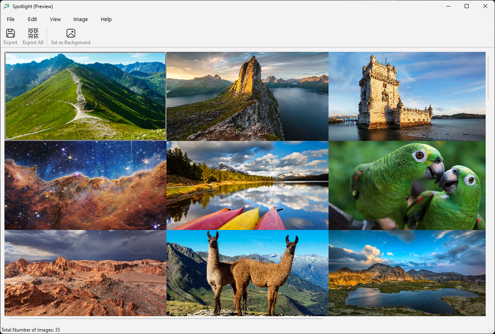
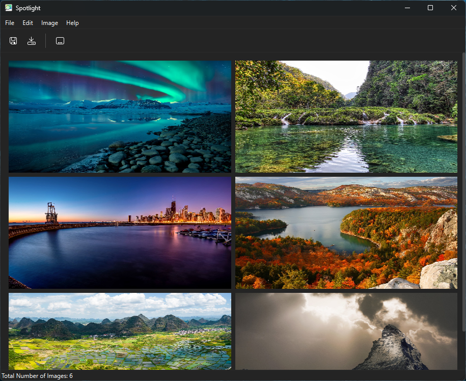

# Spotlight

 ✨Powered by [Weblate](https://weblate.org/en/)✨

**Find your favorite Windows spotlight images**

## Features
- View all of Windows Spotlight's images stored locally on your machine
  - Easily export them as an images on disk
  - Use them as desktop wallpapers

## Chat

## Contributing

See [CONTRIBUTING.md](CONTRIBUTING.md) for details on how can you help the project and how to provide information so we can help you in case of troubles with the app.

## Screenshots

  
Qt

  
  

## Building Manually
Spotlight uses `vcpkg` to manage its dependencies and `cmake` as its build system.

Ensure both `vcpkg` and `cmake` are installed on your system before building.

A C++20 compiler is also required to build Spotlight.

### Configuring vcpkg
1. Set the `VCPKG_ROOT` environment variable to the path of your vcpkg installation's root directory.
#### Windows
1. Set the `VCPKG_DEFAULT_TRIPLET` environment variable to `x64-windows`
1. Run `vcpkg install libnick libjpeg-turbo boost-gil qtbase qtsvg qttools`

### Building
1. First, clone/download the repo.
1. Open a terminal and navigate to the repo's root directory.
1. Create a new `build` directory and `cd` into it. 
#### Windows
1. From the `build` folder, run `cmake .. -G "Visual Studio 17 2022"`.
1. From the `build` folder, run `cmake --build . --config Release`.
1. After these commands complete, Spotlight will be successfully built and its binaries can be found in the `org.nickvision.spotlight.winui/Release` folder of the `build` folder.

## Code of Conduct

This project follows the [GNOME Code of Conduct](https://conduct.gnome.org/).
