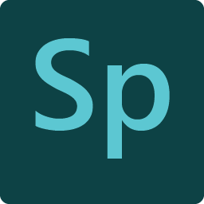
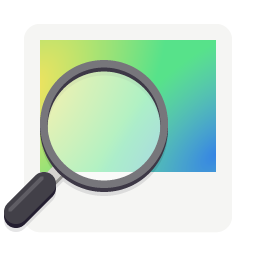
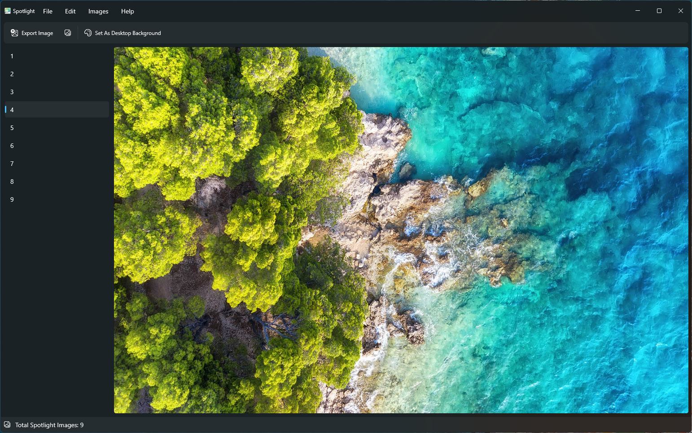

# Nickvision Spotlight

*A utility for working with Windows Spotlight images*

# Screenshots

# Spotlight

 **Find your favorite Windows spotlight images**

# Features
- View all of Windows Spotlight's images
    - Easily export them as an image on disk
    - Use them as desktop wallpapers

# Chat

# Contributing

See [CONTRIBUTING.md](CONTRIBUTING.md) for details on how can you help the project and how to provide information so we can help you in case of troubles with the app.

# WinUI Screenshots

# Dependencies
- [.NET 7](https://dotnet.microsoft.com/en-us/)
